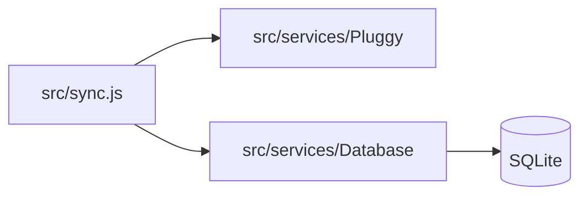

# Open Finance Sync

[](https://bun.sh/)

**Open Finance Sync** reads your Pluggy connection data and writes it to a local **SQLite** database. Each run performs one sync; you invoke it however fits your setup.

API reference: [Pluggy API Reference](https://docs.pluggy.ai/reference). Overview: [Pluggy docs](https://docs.pluggy.ai/docs).

## Prerequisites

- [Bun](https://bun.sh/) 1.1 or newer (`engines` in `[package.json](package.json)`)
- Copy `[.env.example](.env.example)` to `.env` and set `PLUGGY_CLIENT_ID`, `PLUGGY_CLIENT_SECRET`, and comma-separated `ITEM_IDS` (required for the current sync). Other Pluggy ID lists are optional until those features are wired to the database
- Optional: `DATABASE_PATH` (defaults to `data/data.sqlite`). Delete that file if you are resetting the local DB from an older schema

## Architecture




## Sync behavior

- Each run only persists **connection items** (Pluggy items) into the `connection_items` table, using IDs from `ITEM_IDS`. More tables and sync steps can be added incrementally.

## Run

```bash
bun install
bun run sync
```

