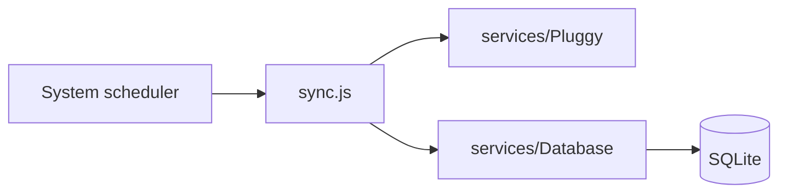

# Open Finance Service

[](https://bun.sh/)

**Open Finance Service** syncs data from [Pluggy](https://www.pluggy.ai/) into a local **SQLite** database. It is meant to run on a **system scheduler** (cron, systemd timer, etc.) on the interval you choose. The app does not implement its own timer.

Pluggy is an Open Finance API: after users connect institutions (items and accounts), balances, cards, and transactions are available via the Pluggy HTTP API. This project reads the IDs you configure in `.env`, fetches the latest data, and upserts rows in SQLite.

API reference: [Pluggy API Reference](https://docs.pluggy.ai/reference). Overview: [Pluggy docs](https://docs.pluggy.ai/docs).

## Prerequisites

- [Bun](https://bun.sh/) 1.1 or newer (`engines` in [`package.json`](package.json))
- Copy [`.env.example`](.env.example) to `.env` and set `PLUGGY_CLIENT_ID`, `PLUGGY_CLIENT_SECRET`, and comma-separated `ITEM_IDS` (required for the current sync). Other Pluggy ID lists are optional until those features are wired to the database
- Optional: `DATABASE_PATH` (defaults to `data/data.sqlite`). Delete that file if you are resetting the local DB from an older schema

## Architecture



## Sync behavior

- The job only persists **connection items** (Pluggy items) into the `connection_items` table, using IDs from `ITEM_IDS`. More tables and sync steps can be added incrementally.

## Run

```bash
bun install
bun run sync
```

Schedule the same command (or `bun run /absolute/path/to/sync.js`) with cron or your OS scheduler. Example (daily at 06:00):

```cron
0 6 * * * cd /path/to/pluggy && /usr/local/bin/bun run sync >> /var/log/pluggy-sync.log 2>&1
```

Adjust the Bun binary path (`which bun`) and project path for your host.
