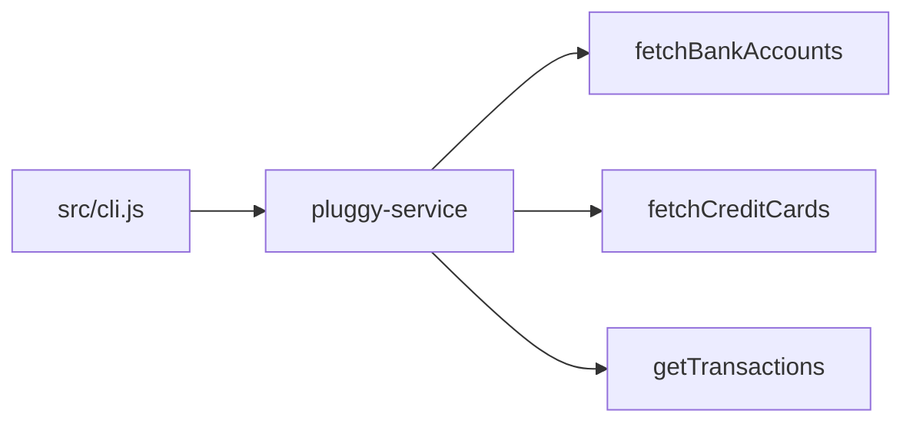

[](https://nodejs.org/)

# Open Finance CLI

[Pluggy](https://www.pluggy.ai/) is an Open Finance API: after a user connects their institutions through Pluggy (items and accounts), you can read balances, cards, and transactions. This repository provides a small command-line client that calls the Pluggy HTTP API. Bank accounts and credit cards are loaded using account IDs listed in your `.env`; the `transactions` subcommand takes `--account-id` (and optional date/pagination flags).

Full HTTP reference: [Pluggy API Reference](https://docs.pluggy.ai/reference). Overview: [Pluggy docs](https://docs.pluggy.ai/docs).

## Prerequisites

- Node.js 18 or newer (see `engines` in `package.json`)
- Run `npm install`
- Copy `.env.example` to `.env` and set `PLUGGY_CLIENT_ID`, `PLUGGY_CLIENT_SECRET`, `PLUGGY_API_KEY`, and comma-separated `BANK_ACCOUNT_IDS` / `CREDIT_CARD_IDS` as needed

## Architecture



## Usage

Commands print JSON to stdout.

With **npm**, use `--` once so everything after it is passed to the CLI (needed when arguments start with `-`, e.g. `--account-id`):

```bash
npm run cli -- --help
npm run cli -- bank-accounts
npm run cli -- credit-cards
npm run cli -- transactions --account-id <uuid> --from 2026-03-01 --to 2026-03-31
```

With **node** directly you can omit npm’s `--`:

```bash
node src/cli.js bank-accounts
```

Optional on `transactions`: `--page`, `--page-size`.
